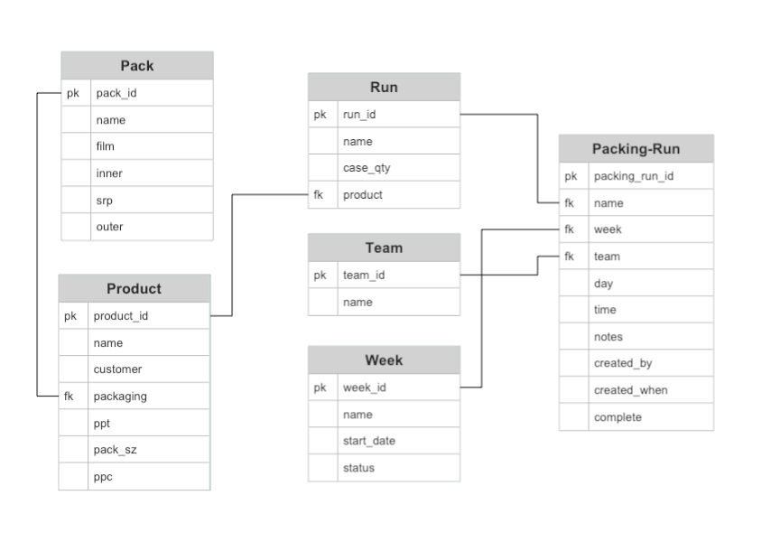

[View the Live Project](https://packing-calc.herokuapp.com)

# Packing Calculator App - Overview

The app is designed to replace an excel sheet that is currently used in a factory bakery to enter a packing plan for a given week.  This plan is used as a reference by various managers in completing their designated tasks.  For the time being the app can create a plan, and its components, and output certain data in tables for reference.  It is assumed that the users communicate outside the bounds of the site when coordinating changes to a plan or other complicated actions (such as stock level monitoring) until more complete systems are implemented in the app.

# Table of Contents
+ [Agile Planning](#agile-planning)
  - [Target Users](#target-users)
  - [User Stories](#user-stories)
  - [Database Schema](#database-schema)
  - [Initial Wireframes](#initial-wireframes)
  - [Visual Design Choices](#visual-design-choices)
+ [Features](#features)
+ [Technologies Used](#technologies-used)
+ [Testing](#testing)
+ [Deployment](#deployment)
+ [Credits](#credits)

# Agile Planning

## Target Users
A specific set of managers in a bakery, could be adapted to a different production planning setting.
- Admin who has access to the whole backend, only user who can delete a plan.
- Operations Manager who creates, updates and deletes components of a plan.
- Packing Manager who views the Packing Calculator to coordinate the packing teams.
- Raw Materials Manager who views the Packing Calculator required packaging.

## User Stories - Big Picture

As a User I want to be able to:
 - Navigate the site quickly and effectively.
 - Login.
 - View which plan is current, in planning or complete.
 - View Reports on a given week.
 - Search for specific Plans, Products, Runs and Packaging Configurations.
 - View Products, Runs and Packing Configurations.
 - Access instructions on how to use and navigate the site.

As the Operations Manager I want to be able to:

 - Create, Read, Update and Delete all important database objects relating to a plan.
 - Leave notes relating to a particular run.
 - Be the only non-admin user able to make changes to a plan or its components.

As the Packing Manager I want to be able to:

 - See what runs are planned for the week.
 - See what times are assigned to each packing team.
 - View notes left by the OpsManager.
 - Mark an assigned run as complete adding a note if necessary.

As the Raw Materials Manager I want to be able to:

 - See what packaging will be required for a week
 - View notes left by the OpsManager.

## Database Schema

## Initial Wireframes

[Wireframes PDF](static/media/initial-wireframes.pdf)

# Features
## Navigation
## Modals
## Search
## Reports
## CRUD Forms
## User Account

# Technologies Used
# Testing
# Deployment
# Credits
