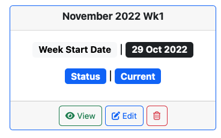

[View the Live Project](https://packing-calc.herokuapp.com)

# Packing Calc App - Overview

# Table of Contents
+ [Planning](#planning)
  - [Target Users](#target-users)
  - [User Stories](#user-stories)
  - [Database Schema](#database-schema)
  - [Initial Wireframes](#initial-wireframes)
  - [Visual Design Choices](#visual-design-choices)
+ [Features](#features)
  - [Navigation](#navigation)
  - [Search Pages](#search-pages)
  - [Create Form](#create-form)
  - [Update Form](#update-form)
  - [Delete Form](#delete-form)
  - [Detail Pages](#update-form)
  - [Modals](#modals)
  - [User Accounts](#user-accounts)
  - [Messages](#messages)
+ [Technologies Used](#technologies-used)
+ [Testing](#testing)
+ [Deployment](#deployment)
+ [Credits](#credits)

# Planning

Access the [Projects Board](https://github.com/users/RadheyaM/projects/2) for this project.

## Target Users
A set of managers in a bakery, could be adapted to a different production/planning setting.
- Admin who has access to the whole backend, only user who can delete a plan, not a daily user but someone who fixes issues when they arise.
- Operations Manager who creates, updates and deletes components of a plan. The main creator on the site.
- Packing Manager who views the Live Plan to coordinate the packing teams, can indicate when a run is completed.
- Raw Materials Manager who views the Live Plan, especially required packaging.

### Account Permissions
 - Admin, all access.
 - OpsManager, CRUD functionality except to delete plans.  Can't access the Admin site.
 - PackingManager, View and Edit a Packing Run to indicate when it has been successfully packed.
 - Manager, can View but not change anything.
 - New User, For the purposes of development/submitting to be marked a user can create an account and immediately have access to view the site, although not any CRUD functionality - in real use setting that would not be desirable.

## User Stories

As a User I want to be able to:
 - Navigate the site quickly and effectively.
 - Login, logout.
 - View which plan is current, in planning or complete.
 - View reports on a given week.
 - Search for specific Plans, Products, Runs and Packaging Configurations.
 - View Products, Runs and Packing Configurations.
 - Access instructions on how to use and navigate the site.

As the Operations Manager I want to be able to:

 - Create, retrieve, update and delete all important database objects relating to a plan.
 - Leave notes relating to a particular run.
 - Be the only non-admin user able to make changes to a plan or its components.
 - Generate effective and useful reports in the Detail/Live Plan views for other members of the team to get their jobs done.

As the Packing Manager I want to be able to:

 - See what runs are planned for the week.
 - See what times are assigned to each packing team.
 - View notes left by the OpsManager.
 - Mark an assigned run as complete adding a note if necessary.

As the Raw Materials Manager I want to be able to:

 - See what packaging will be required for a week
 - View notes left by the OpsManager.
 - View existing packaging configurations to confirm correct.

## Database Schema

## Initial Wireframes

[Wireframes PDF](media/readme-design/initial-wireframes.pdf)

## Application Flowcharts

## Visual Design Choices 

### The use of colour
The site has a red navigation bar and footer as that is the colour of the company it's designed for.

Colour on the rest of the site is used mostly to signify function to the user.  The colour in buttons shows function is available and particular colour used also indicates if the action is to view/create (greens), edit (blue), delete (red).  Text can be missed but the combination of text and a particular colour should help reinforce meaning to the user. 

Just as stars stand out in the night sky because of the surrounding blackness, so the buttons and colourful highlights of the site stand out and are much more effect against a clear white background.  This approach is taken by many large and successful sites, such as Google and Amazon.

Colour used to indicate function to the user:
 

 

 

 

 

 

 

### Icons
Icons are used throughout the site to signify function to the user.  An image speaks a thousand words and a trash can is just as effect as writing 'delete' while being more visually appealing.  Images alongside words look good and convey meaning quicker to the user giving the whole experience of navigation a more intuitive feeling.

# Features

## Navigation
 
 

 

 
At the top of the app is a navigation bar.  The left-hand side contains a link to the Live Plan (as shown above) and the other four links lead to the Plans, Packaging, Products and Runs search pages respectively.  To the right we have an Account Logged in name (unless not loggedin), which when clicked provides a dropdown with change password and logout functionality.  Next to that is a button that triggers a help modal and finally a previous page button.

## Search Pages
 

There are four search pages, one for each of the objects that can be created to make up a plan run.  Each search page starts with extra in-page navigation buttons to toggle smoothly between the pages and to indicate which page is active with a red background.  
Below that is a search bar.  On searching a term in the title of the items listed below, the items will be filtered accordingly.  The clear button will reveal all objects once again.

Each item is created as a card with a title and relevant information.  At the top of this section is a Create New button which gives the user Create functionality.  Attached to the bottom of the card items are View, Edit and Delete buttons displayed variably according the item and to the level of permission which the current user has been granted by Admin.

## Create Form
  Example given is for product, but the same functionality is available for all the essential database objects.  Only users with permission can use this functionality.

   
  

### Form Field Data Validation
   
  
   
  

### On Success Message
  

### Newly Created Object
  

## Update Form

 

 

## Delete Form

## Detail Pages

The Detail Page displays what runs are assigned to a particular plan.  It contains four reports tailored to certain managers and their specific tasks.  The Live Plan can be accessed via the Live Plan navlink.  A detail view can be accessed for any plan from the plan search page by clicking 'view'.

### Add Run to Plan
  A plan is made up of a collection of runs assigned to it, all the information contained within the detail pages are made up from the runs assigned and the information contained within each run, which in turn is linked to products, teams, packaging.
  To add a run, click the button in the header.

  

### Update and Delete
  same templates as outlined above.

### Notes
  There is also a button in the header to trigger the notes modal which will be detailed below in the Modals section.
### Accrodion Format
  Each table can be expanded/minimised to see the relevant info quickly and hide irrelevant data according to the users preference.
   
  

### Plan Summary Table
  Shows summary information.  If completed the row turns green.  Displays Edit and Delete buttons for users with permission to perform these changes.

   
  

### Plan Calculations Table
  Information useful to the Operations Manager when conducting meetings with Production Managers and making plans etc.

   
  

### Team Times Table
  Information particularly useful to the Packing Manager when scheduling in teams for the week.  Minutes are used in this particular bakery.

   
  

### Packaging Required Table(s)
  This information is for the Raw Materials Manager and Stores to check and make sure that packaging is in stock and available when needed for the packing teams.

   
  

## Modals

   
  

### Help Modal
  On clicking 'HELP' in the navbar the user opens a modal which gives help depending on the level of permission granted to the user.  If the user doesn't have creation permission they won't get advice on how to create for instance.

   
  

### Notes Modal
  Within the detail and live-plan templates the user can click on the notes button in the header and view a modal with all notes ascribed to a packing run displayed in descending order by day and with product info etc.

## User Accounts
 

 The Username is displayed in the dropdown button on the right of the navigation bar.

### SignUp
  

### SignIn
  
  
  
  
### Change Password
  

### SignOut
  
  
  

## Messages
As seen above there are success messages generated for all actions that affect a database object.
There are info messages on the forms giving useful information.

On the Search Plan page there is a grey expandable and dismissable alert box for some very inportant information.

# Technologies Used
 - Python
 - HTML
 - Django
 - CSS
 - Bootstrap5
 - Git
 - GitHub
 - Heroku
 - 
# Testing
## Python Validation
[CI Python Linter](https://pep8ci.herokuapp.com/) used to check Python files.

### HTML Validation
[Nu HTML Checker - PASSED](media/readme-test/Showing%20results%20for%20https%3Apacking-calc.herokuapp.com%20-%20Nu%20Html%20Checker.pdf)  - I disabled the login requirement so that the site could be checked by Address.

### CSS Validation
[Jigsaw CCS Validation Service Result](media/readme-test/jigsaw-css-validation-result.pdf) - There are lots of errors associated with the Bootsrap CDN, which I am not considering, my custom css is in the valid code block if you scroll to the bottom of the results.

### JavaScript Validation
I did not use any custom JavaScript so no testing necessary.

## Functionality Tests
[Tests Excel Sheet](media/readme-test/Packing_calc_testing.xlsx)

## Lighthouse Test Scores

## Screen Responsiveness

# Deployment
# Credits
